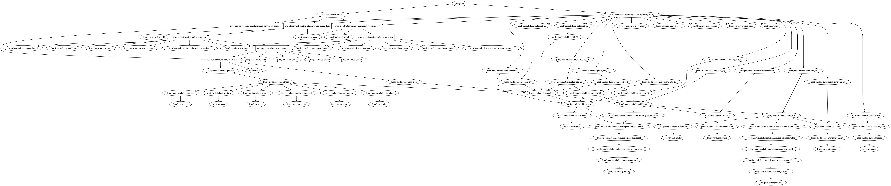

# terraform-aws-ecs-service-autoscale-step-sqs

[](https://circleci.com/gh/appzen-oss/terraform-aws-ecs-service-autoscale-step-sqs)
[](https://github.com/appzen-oss/terraform-aws-ecs-service-autoscale-step-sqs/releases)

Terraform module to manage application autoscaling for an ECS service based
on a SQS queue's length

[Terraform registry](https://registry.terraform.io/modules/appzen-oss/ecs-service-autoscale-step-sqs/aws)

## Usage

### Basic Example

```hcl
module "" {
  source        = "appzen-oss/ecs-service-autoscale-step-sqs/aws"
  version       = "0.0.1"
}
```

<!-- BEGINNING OF PRE-COMMIT-TERRAFORM DOCS HOOK -->
## Inputs

| Name | Description | Type | Default | Required |
|------|-------------|:----:|:-----:|:-----:|
| adjustment\_type | Autoscaling policy adjustment type (ChangeInCapacity, PercentChangeInCapacity) | string | `"ChangeInCapacity"` | no |
| attributes | Suffix name with additional attributes (policy, role, etc.) | list | `<list>` | no |
| cluster\_name | Name of ECS cluster that service is in | string | n/a | yes |
| component | TAG: Underlying, dedicated piece of service (Cache, DB, ...) | string | `"UNDEF-ECSAutoScaleSQS"` | no |
| delimiter | Delimiter to be used between `name`, `namespaces`, `attributes`, etc. | string | `"-"` | no |
| environment | Environment (ex: `dev`, `qa`, `stage`, `prod`). (Second or top level namespace. Depending on namespacing options) | string | n/a | yes |
| high\_eval\_periods | The number of periods over which data is compared to the high threshold | string | `"1"` | no |
| high\_period\_secs | The period in seconds over which the high statistic is applied | string | `"60"` | no |
| high\_threshold | The value against which the high statistic is compared | string | `"1000"` | no |
| low\_eval\_periods | The number of periods over which data is compared to the low threshold | string | `"1"` | no |
| low\_period\_secs | The period in seconds over which the low statistic is applied | string | `"60"` | no |
| low\_threshold | The value against which the low statistic is compared | string | `"100"` | no |
| max\_capacity | Maximum number of tasks to scale to | string | `"5"` | no |
| min\_capacity | Minimum number of tasks to scale to | string | `"0"` | no |
| monitor | TAG: Should resource be monitored | string | `"UNDEF-ECSAutoScaleSQS"` | no |
| name | Base name for resource | string | n/a | yes |
| namespace-env | Prefix name with the environment. If true, format is: `{env}-{name}` | string | `"true"` | no |
| namespace-org | Prefix name with the organization. If true, format is: `{org}-{env namespaced name}`. If both env and org namespaces are used, format will be `{org}-{env}-{name}` | string | `"false"` | no |
| organization | Organization name (Top level namespace) | string | `""` | no |
| owner | TAG: Owner of the service | string | `"UNDEF-ECSAutoScaleSQS"` | no |
| product | TAG: Company/business product | string | `"UNDEF-ECSAutoScaleSQS"` | no |
| queue\_name | Name of SQS queue to monitor | string | n/a | yes |
| scale\_down\_cooldown | The amount of time, in seconds, after a scaling down completes and before the next scaling activity can start | string | `"60"` | no |
| scale\_down\_count | The number of members by which to scale down, when the adjustment bounds are breached. Should always be negative value | string | `"-3"` | no |
| scale\_down\_lower\_bound | The lower bound for the difference between the alarm threshold and the CloudWatch metric. Without a value, AWS will treat this bound as negative infinity | string | `""` | no |
| scale\_down\_min\_adjustment\_magnitude | Minimum number of tasks to scale down at a time | string | `"10"` | no |
| scale\_down\_upper\_bound | The upper bound for the difference between the alarm threshold and the CloudWatch metric. Without a value, AWS will treat this bound as infinity | string | `"0"` | no |
| scale\_up\_cooldown | The amount of time, in seconds, after a scaling up completes and before the next scaling up can start | string | `"60"` | no |
| scale\_up\_count | The number of members by which to scale up, when the adjustment bounds are breached. Should always be positive value | string | `"5"` | no |
| scale\_up\_lower\_bound | The lower bound for the difference between the alarm threshold and the CloudWatch metric. Without a value, AWS will treat this bound as negative infinity | string | `"0"` | no |
| scale\_up\_min\_adjustment\_magnitude | Minimum number of tasks to scale up at a time | string | `"10"` | no |
| scale\_up\_upper\_bound | The upper bound for the difference between the alarm threshold and the CloudWatch metric. Without a value, AWS will treat this bound as infinity | string | `""` | no |
| service | TAG: Application (microservice) name | string | `"UNDEF-ECSAutoScaleSQS"` | no |
| service\_name | Name of ECS service to autoscale | string | n/a | yes |
| tags | A map of additional tags | map | `<map>` | no |
| team | TAG: Department/team of people responsible for service | string | `"UNDEF-ECSAutoScaleSQS"` | no |

<!-- END OF PRE-COMMIT-TERRAFORM DOCS HOOK -->
<!-- BEGINNING OF PRE-COMMIT-TERRAFORM GRAPH HOOK -->

### Resource Graph of plan


<!-- END OF PRE-COMMIT-TERRAFORM GRAPH HOOK -->
